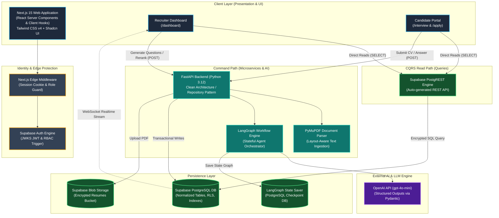
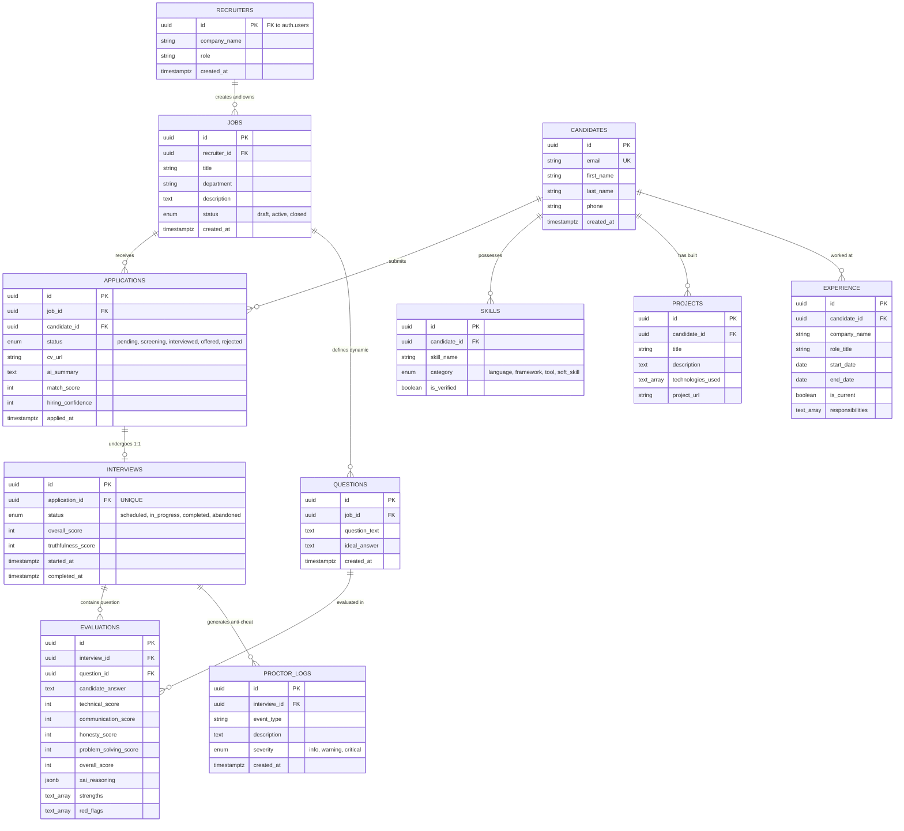
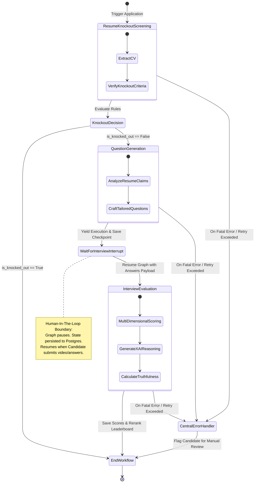

# AI-Recruit360: Autonomous Technical Recruitment Platform
## Master System Architecture & Engineering Specification

> **BS Software Engineering Final Year Project (FYP) Thesis Documentation**  
> **Author**: AI-Recruit360 Development Team  
> **Target Audience**: University Faculty, Thesis Examination Board, Industry Startup Evaluators  
> **System Classification**: Decoupled Microservices, CQRS-Inspired Async Processing, Multi-Agent LLM Orchestration  
> **Document Version**: 1.0.0 (Production Grade)  
> **Last Updated**: August 2026

---

## Executive Summary & FYP Thesis Abstract

**AI-Recruit360** is an enterprise-grade, autonomous, AI-driven technical recruitment and candidate evaluation platform engineered to revolutionize tech hiring. Traditional recruitment pipelines suffer from resume spam, subjective human bias, high financial costs, slow turnaround times, and lack of objective technical verification.

AI-Recruit360 resolves these challenges by introducing a **fully automated, explainable, anti-cheat technical screening ecosystem**. The system combines document parsing (**PyMuPDF**), deterministic structured information extraction (**OpenAI Structured Outputs**), stateful multi-agent orchestrations (**LangGraph** with PostgreSQL checkpointers), multi-dimensional candidate evaluation with **Explainable AI (XAI)** reasoning, anti-cheat proctoring telemetry, and real-time candidate analytics dashboards.

### Core Engineering Innovations
1. **Command Query Responsibility Segregation (CQRS) Architecture**: Fast, zero-overhead read queries execute directly between Next.js Edge/Server components and Supabase PostgREST, while complex AI/NLP commands route to a dedicated FastAPI microservice.
2. **Stateful Multi-Agent Workflow Engine**: Powered by LangGraph, handling multi-step asynchronous processing across days of candidate latency with checkpoint persistence and human-in-the-loop interrupt nodes.
3. **Multi-Dimensional Explainable AI (XAI)**: Scores candidates across Technical Capability (40%), Problem Solving (25%), Communication (15%), and Honesty/Integrity (20%), providing verifiable transcript quotes and claim-vs-reality audits for every metric.
4. **Behavioral Proctoring Telemetry**: Audit logs capturing tab switches, answer velocity, and response anomalies to detect AI usage or script reading during interviews.
5. **Zero-Trust Role-Based Access Control (RBAC)**: Defense-in-depth security spanning Next.js Edge Middleware, FastAPI dependency injection, and Supabase Row Level Security (RLS).

---

## 1. High-Level System Architecture

The AI-Recruit360 platform adopts a decoupled, multi-tiered microservices architecture designed for extreme availability, sub-100ms UI responsiveness, and resilience against non-deterministic AI latency.



---

## 2. Command Query Responsibility Segregation (CQRS) Architecture

To guarantee maximum speed and throughput, AI-Recruit360 separates read operations (Queries) from write/processing operations (Commands).

```mermaid
sequenceDiagram
    autonumber
    actor Recruiter as Recruiter / Candidate
    participant NextJS as Next.js 15 Frontend
    participant PostgREST as Supabase PostgREST
    participant FastAPI as FastAPI AI Microservice
    participant OpenAI as OpenAI API (gpt-4o-mini)
    participant Postgres as Supabase PostgreSQL

    %% Query Path
    rect rgb(30, 41, 59)
        note right of Recruiter: CQRS Query Path (Zero Latency Reads)
        Recruiter->>NextJS: Navigate to Dashboard / Leaderboard
        NextJS->>PostgREST: SELECT * FROM applications JOIN interviews...
        PostgREST->>Postgres: Direct Execution (Enforced by RLS)
        Postgres-->>PostgREST: JSON Results
        PostgREST-->>NextJS: Render Server Components (<50ms)
    end

    %% Command Path
    rect rgb(15, 118, 110)
        note right of Recruiter: CQRS Command Path (AI Processing & Mutations)
        Recruiter->>NextJS: Submit Candidate CV or Submit Interview Response
        NextJS->>FastAPI: POST /api/v1/applications/parse-resume
        FastAPI->>OpenAI: Request Structured Output (Pydantic Schema)
        OpenAI-->>FastAPI: Validated JSON Response
        FastAPI->>Postgres: Transactional INSERT into applications, skills, evaluations
        Postgres-->>FastAPI: Commit OK
        FastAPI-->>NextJS: Return HTTP 201 Created
        Postgres-->>NextJS: Supabase Realtime WebSocket Event (UI Auto-Update)
    end
```



### Operation Allocation Matrix

| Operation Category | Target Engine | Architectural Rationale |
| :--- | :--- | :--- |
| **Read Dashboard Analytics** | PostgREST (Direct) | Eliminates Python backend overhead. Edge rendering in React Server Components. |
| **Read Candidate Leaderboards** | PostgREST (Direct) | Leverages Postgres B-Tree composite indexes for direct sort/pagination. |
| **Read Job Listings** | PostgREST (Direct) | Secured via public/recruiter Supabase Row Level Security (RLS). |
| **Parse Resume (PDF to JSON)** | FastAPI Backend | PyMuPDF parsing & heavy Regex normalization cannot run on Vercel Edge. |
| **Generate Technical Questions** | FastAPI + OpenAI | Complex prompt engineering, state validation, structured output mapping. |
| **Evaluate Interview Responses** | FastAPI + LangGraph | Multi-dimensional scoring, transcript quotation extraction, and score aggregation. |
| **Proctoring Telemetry Ingestion** | FastAPI Backend | Anti-cheat detection logic and automated truthfulness scoring triggers. |

---

## 3. Database Schema & Relational Design

The system runs on PostgreSQL hosted on Supabase, featuring full normalization, strict check constraints, foreign key cascades, and high-performance indexes.

### Entity-Relationship Diagram (ERD)



### Relational Schema Definition & Foreign Key Rules

```sql
-- 1. RECRUITERS (Extends auth.users)
CREATE TABLE public.recruiters (
    id UUID PRIMARY KEY REFERENCES auth.users(id) ON DELETE CASCADE,
    company_name VARCHAR(255) NOT NULL,
    role VARCHAR(50) DEFAULT 'recruiter' CHECK (role IN ('admin', 'recruiter')),
    created_at TIMESTAMPTZ DEFAULT timezone('utc', now()) NOT NULL
);

-- 2. JOBS
CREATE TABLE public.jobs (
    id UUID DEFAULT gen_random_uuid() PRIMARY KEY,
    recruiter_id UUID REFERENCES public.recruiters(id) ON DELETE SET NULL,
    title VARCHAR(255) NOT NULL,
    department VARCHAR(100),
    description TEXT NOT NULL,
    status VARCHAR(20) DEFAULT 'active' CHECK (status IN ('draft', 'active', 'closed')),
    created_at TIMESTAMPTZ DEFAULT timezone('utc', now()) NOT NULL,
    updated_at TIMESTAMPTZ DEFAULT timezone('utc', now()) NOT NULL
);

-- 3. CANDIDATES
CREATE TABLE public.candidates (
    id UUID DEFAULT gen_random_uuid() PRIMARY KEY,
    email VARCHAR(255) UNIQUE NOT NULL,
    first_name VARCHAR(100) NOT NULL,
    last_name VARCHAR(100) NOT NULL,
    phone VARCHAR(50),
    created_at TIMESTAMPTZ DEFAULT timezone('utc', now()) NOT NULL
);

-- 4. APPLICATIONS
CREATE TABLE public.applications (
    id UUID DEFAULT gen_random_uuid() PRIMARY KEY,
    job_id UUID NOT NULL REFERENCES public.jobs(id) ON DELETE CASCADE,
    candidate_id UUID NOT NULL REFERENCES public.candidates(id) ON DELETE CASCADE,
    status VARCHAR(30) DEFAULT 'pending' CHECK (status IN ('pending', 'screening', 'interviewed', 'offered', 'rejected')),
    cv_url VARCHAR(512) NOT NULL,
    ai_summary TEXT,
    match_score SMALLINT CHECK (match_score >= 0 AND match_score <= 100),
    hiring_confidence SMALLINT CHECK (hiring_confidence >= 0 AND hiring_confidence <= 100),
    applied_at TIMESTAMPTZ DEFAULT timezone('utc', now()) NOT NULL,
    CONSTRAINT unique_candidate_per_job UNIQUE(job_id, candidate_id)
);

-- 5. QUESTIONS
CREATE TABLE public.questions (
    id UUID DEFAULT gen_random_uuid() PRIMARY KEY,
    job_id UUID NOT NULL REFERENCES public.jobs(id) ON DELETE CASCADE,
    question_text TEXT NOT NULL,
    ideal_answer TEXT,
    created_at TIMESTAMPTZ DEFAULT timezone('utc', now()) NOT NULL
);

-- 6. INTERVIEWS
CREATE TABLE public.interviews (
    id UUID DEFAULT gen_random_uuid() PRIMARY KEY,
    application_id UUID UNIQUE NOT NULL REFERENCES public.applications(id) ON DELETE CASCADE,
    status VARCHAR(30) DEFAULT 'scheduled' CHECK (status IN ('scheduled', 'in_progress', 'completed', 'abandoned')),
    overall_score SMALLINT CHECK (overall_score >= 0 AND overall_score <= 100),
    truthfulness_score SMALLINT CHECK (truthfulness_score >= 0 AND truthfulness_score <= 100),
    started_at TIMESTAMPTZ,
    completed_at TIMESTAMPTZ
);

-- 7. EVALUATIONS
CREATE TABLE public.evaluations (
    id UUID DEFAULT gen_random_uuid() PRIMARY KEY,
    interview_id UUID NOT NULL REFERENCES public.interviews(id) ON DELETE CASCADE,
    question_id UUID NOT NULL REFERENCES public.questions(id) ON DELETE CASCADE,
    candidate_answer TEXT NOT NULL,
    technical_score SMALLINT CHECK (technical_score >= 0 AND technical_score <= 100),
    communication_score SMALLINT CHECK (communication_score >= 0 AND communication_score <= 100),
    honesty_score SMALLINT CHECK (honesty_score >= 0 AND honesty_score <= 100),
    problem_solving_score SMALLINT CHECK (problem_solving_score >= 0 AND problem_solving_score <= 100),
    overall_score SMALLINT CHECK (overall_score >= 0 AND overall_score <= 100),
    xai_reasoning JSONB NOT NULL,
    strengths TEXT[] DEFAULT '{}',
    red_flags TEXT[] DEFAULT '{}',
    created_at TIMESTAMPTZ DEFAULT timezone('utc', now()) NOT NULL,
    CONSTRAINT unique_question_per_interview UNIQUE(interview_id, question_id)
);

-- 8. PROCTOR_LOGS
CREATE TABLE public.proctor_logs (
    id UUID DEFAULT gen_random_uuid() PRIMARY KEY,
    interview_id UUID NOT NULL REFERENCES public.interviews(id) ON DELETE CASCADE,
    event_type VARCHAR(100) NOT NULL,
    description TEXT,
    severity VARCHAR(20) CHECK (severity IN ('info', 'warning', 'critical')),
    created_at TIMESTAMPTZ DEFAULT timezone('utc', now()) NOT NULL
);
```

### Performance Indexing Strategy
```sql
CREATE INDEX idx_jobs_recruiter ON public.jobs(recruiter_id);
CREATE INDEX idx_applications_job ON public.applications(job_id);
CREATE INDEX idx_applications_candidate ON public.applications(candidate_id);
CREATE INDEX idx_interviews_application ON public.interviews(application_id);
CREATE INDEX idx_evaluations_interview ON public.evaluations(interview_id);
CREATE INDEX idx_evaluations_composite ON public.evaluations(interview_id, question_id);
CREATE INDEX idx_proctor_logs_interview ON public.proctor_logs(interview_id);
```

---

## 4. AI Evaluation Engine & Explainable AI (XAI) Architecture

The AI Evaluation Engine converts raw audio/text interview transcripts and candidate resumes into multi-dimensional, explainable assessments.

### Multi-Dimensional Scoring Mathematical Model

$$Score_{Overall} = 0.40 \cdot Score_{Technical} + 0.25 \cdot Score_{ProblemSolving} + 0.15 \cdot Score_{Communication} + 0.20 \cdot Score_{Honesty}$$

```math
\text{Hard Gate Rule: If } Score_{Honesty} < 40 \implies \text{Status} = \text{"Risk Detected"}
```

| Metric Dimension | Weight | Primary Data Input | Scoring Logic & Objective |
| :--- | :--- | :--- | :--- |
| **Technical Capability** | **40%** | Resume + Question + Answer | Measures code accuracy, architectural depth, and framework expertise. Cross-referenced against resume claims. |
| **Problem Solving** | **25%** | Candidate Answer Structure | Evaluates breakdown methodology, edge case handling, and architectural reasoning under constraints. |
| **Communication** | **15%** | Interview Transcript | Analyzes clarity, articulation, structural flow, and brevity. Penalizes filler words and rambling. |
| **Honesty & Integrity** | **20%** | Resume vs. Transcript + Proctor Logs | Cross-checks resume claims with real answers. Flags speed anomalies (reading scripts) or tab-switches. |

### Explainable AI (XAI) Reasoning Triad

To ensure full transparency for hiring managers and eliminate "black-box AI" distrust, the system mandates three explainability anchors in every evaluation:

1. **Claim vs. Reality Audit**: Explicit comparison between CV claims and interview performance.
   - *Example*: "CV claims 5 years of Senior React leadership; however, candidate failed to explain the Virtual DOM reconciliation algorithm."
2. **Direct Transcript Evidence Quotation**: Exact verbatim quotes extracted from the interview transcript to support every score deduction or praise.
   - *Example*: *"Quote at [03:14]: 'I haven't actually used Redux in production, I mostly read about it.'"*
3. **Rubric Mapping**: Explicit justification mapping the numerical score to standardized rubrics (Exceptional 90+, Strong 70-89, Average 50-69, Red Flag <50).

### Enforced Pydantic Output Schema (OpenAI Structured Outputs)

```python
from pydantic import BaseModel, Field
from typing import List

class XAIReasoning(BaseModel):
    technical_analysis: str = Field(description="Claim vs Reality breakdown of technical accuracy.")
    communication_analysis: str = Field(description="Structural analysis of articulation and clarity.")
    honesty_analysis: str = Field(description="Contradiction check between CV and interview answers.")
    problem_solving_analysis: str = Field(description="Methodological evaluation of answer structure.")

class MetricScores(BaseModel):
    technical_score: int = Field(ge=0, le=100)
    communication_score: int = Field(ge=0, le=100)
    honesty_score: int = Field(ge=0, le=100)
    problem_solving_score: int = Field(ge=0, le=100)
    overall_score: int = Field(ge=0, le=100)

class CandidateEvaluationOutput(BaseModel):
    xai_reasoning: XAIReasoning
    scores: MetricScores
    strengths: List[str] = Field(description="Key verified strengths.")
    red_flags: List[str] = Field(description="Contradictions, cheating signals, or severe technical gaps.")
```

---

## 5. LangGraph Stateful Multi-Agent Workflow Engine

Candidate interviews are asynchronous by nature. A candidate might apply on Monday and complete the video interview on Thursday. LangGraph handles this multi-step state persistence using an **`AsyncPostgresSaver` Checkpointer**.

### Multi-Agent State Diagram



### Graph State Pydantic Model (`GraphState`)

```python
from typing import TypedDict, List, Optional
from pydantic import BaseModel

class InterviewQAPair(BaseModel):
    question_id: str
    question_text: str
    candidate_answer: str

class GraphState(TypedDict):
    # Immutable Session Inputs
    candidate_id: str
    job_id: str
    job_description: str
    resume_text: str
    
    # Agent 1 (Knockout) Outputs
    knockout_score: Optional[int]
    is_knocked_out: Optional[bool]
    knockout_reason: Optional[str]
    
    # Agent 2 (Question Generation) Outputs
    generated_questions: Optional[List[dict]]
    
    # Human-In-The-Loop Input (Submitted via Web Hook)
    candidate_answers: Optional[List[InterviewQAPair]]
    proctor_events: Optional[List[dict]]
    
    # Agent 3 (Evaluation & XAI) Outputs
    evaluation_scores: Optional[dict]
    overall_score: Optional[int]
    truthfulness_score: Optional[int]
    final_decision: Optional[str] # "Verified Match", "Review Needed", "Risk Detected"
    
    # Fault Tolerance & Resilience
    errors: List[str]
    retry_count: int
```

---

## 6. Resume Processing & Skill Extraction Pipeline

The document processing pipeline converts unstructured PDF resumes into structured candidate profiles using **PyMuPDF (`fitz`)** and **OpenAI Structured Outputs**.

```mermaid
flowchart LR
    PDF[Candidate Uploads PDF Resume] --> PyMuPDF[PyMuPDF Parser\n(fitz Engine)]
    PyMuPDF --> Cleaner[Text Sanitizer & Normalizer\n(Regex Ligature Removal)]
    Cleaner --> OpenAI[OpenAI Extraction Engine\n(gpt-4o-mini)]
    
    subgraph Structured_Parsing ["Pydantic JSON Extraction"]
        OpenAI --> Skills[Extract Skills\n(Languages, Frameworks, Tools)]
        OpenAI --> Experience[Extract Work Experience\n(Company, Role, Dates, Wins)]
        OpenAI --> Projects[Extract Projects\n(Tech Stack, Summary, URLs)]
        OpenAI --> Summary[Generate AI Profile Summary]
    end

    Skills & Experience & Projects & Summary --> Mapper[Data Mapper & Validator]
    Mapper --> DB[(Supabase PostgreSQL\nInsert Candidate & Application)]
```

### Robust Error Handling Matrix

| Pipeline Stage | Failure Mode | Detection Mechanism | Automated Fallback / Recovery |
| :--- | :--- | :--- | :--- |
| **File Ingestion** | Encrypted / Corrupted PDF | `fitz.FileDataError` | Reject immediately with HTTP 400 (`"Encrypted PDF detected"`). |
| **Text Extraction** | Scanned / Image-Only PDF | Char count `< 50` | Trigger Tesseract OCR fallback; if missing, reject with HTTP 422. |
| **LLM Processing** | OpenAI Rate Limit / 503 | `openai.RateLimitError` | `tenacity` exponential backoff (retries at 2s, 4s, 8s). |
| **Schema Mapping** | Pydantic Schema Violation | `ValidationError` | Re-prompt with strict schema instruction once; log error. |
| **Database Persistence** | Postgres Constraint Failure | `postgrest.APIError` | Rollback transaction, log to Sentry, respond with HTTP 500. |

---

## 7. Authentication, Authorization & Security Architecture

Security is architected around a zero-trust model handling sensitive Personally Identifiable Information (PII).

```mermaid
flowchart TD
    Req[Incoming Client Request] --> Edge[Layer 1: Next.js Edge Middleware\n(Validate Session Cookie & Route Role)]
    Edge -->|Authorized| API[Layer 2: FastAPI Dependency Injection\n(require_recruiter / require_candidate)]
    API -->|Valid Token| DB[Layer 3: Supabase Row Level Security\n(Postgres RLS Policies)]
    DB --> Output[Access Granted / Data Returned]

    Edge -->|Invalid Role| Deny1[HTTP 403 Forbidden / Redirect to Login]
    API -->|Invalid JWT| Deny2[HTTP 401 Unauthorized]
    DB -->|RLS Violation| Deny3[Empty Dataset / SQL Access Denied]
```

### Multi-Tenant Row Level Security (RLS) Policy Specifications

```sql
-- Enable RLS across all tables
ALTER TABLE public.recruiters ENABLE ROW LEVEL SECURITY;
ALTER TABLE public.jobs ENABLE ROW LEVEL SECURITY;
ALTER TABLE public.applications ENABLE ROW LEVEL SECURITY;
ALTER TABLE public.interviews ENABLE ROW LEVEL SECURITY;
ALTER TABLE public.evaluations ENABLE ROW LEVEL SECURITY;

-- 1. JOBS: Public can read active jobs; Recruiters manage their own jobs
CREATE POLICY "Public read active jobs" ON public.jobs 
    FOR SELECT USING (status = 'active');

CREATE POLICY "Recruiters manage own jobs" ON public.jobs 
    FOR ALL USING (recruiter_id = auth.uid());

-- 2. APPLICATIONS: Recruiters only read applications for jobs they own
CREATE POLICY "Recruiters read job applications" ON public.applications 
    FOR SELECT USING (
        EXISTS (
            SELECT 1 FROM public.jobs 
            WHERE jobs.id = applications.job_id 
            AND jobs.recruiter_id = auth.uid()
        )
    );

-- 3. EVALUATIONS: Strictly restricted to owning recruiter or service_role
CREATE POLICY "Recruiters view evaluations" ON public.evaluations 
    FOR SELECT USING (
        EXISTS (
            SELECT 1 FROM public.interviews
            JOIN public.applications ON applications.id = interviews.application_id
            JOIN public.jobs ON jobs.id = applications.job_id
            WHERE interviews.id = evaluations.interview_id
            AND jobs.recruiter_id = auth.uid()
        )
    );
```

---

## 8. Recruiter Analytics & Dashboard Component Architecture

The frontend follows Next.js 15 App Router conventions, splitting rendering duties between **React Server Components (RSC)** for low-latency fetches and **Client Components** for dynamic data visualizations.

```text
src/app/(dashboard)/dashboard/jobs/[id]/page.tsx (Server Component)
├── JobMetricCards (Server Component - Direct PostgREST Fetch)
├── AnalyticsOverview (Client Component - Recharts Wrapper)
│   ├── ScoreDistributionBarChart (Histogram of Candidate Scores)
│   └── PipelineVelocityAreaChart (Interviews Completed per Day)
└── CandidateLeaderboard (Client Component - Shadcn DataTable)
    ├── FilterToolbar (Search, Status Filter, Risk Toggle)
    ├── SortableHeader (Overall Score, Technical, Honesty)
    └── CandidateRowActions (Deep-Dive View Modal / Download CV)
```

### Visual Analytics Specification (Recharts)

1. **Candidate Profile Radar Chart**: Visualizes the candidate's 4-dimensional score footprint (Technical, Problem Solving, Communication, Honesty) against the job baseline.
2. **Score Distribution Histogram**: Groups candidate scores into buckets (`<50`, `50-69`, `70-89`, `90-100`) to highlight talent pool density.
3. **Proctoring Incident Timeline**: Chronological audit trail rendering tab-switch events and answer speed anomalies during candidate interviews.

---

## 9. Backend Clean Architecture & Codebase Layout

The backend is structured using **Clean Architecture** and the **Repository Pattern**, decoupling API routing, business logic, AI orchestration, and database access.

```text
backend/
├── src/
│   ├── api/                    # Presentation Layer
│   │   ├── dependencies/       # FastAPI Depends (auth, require_recruiter, get_db)
│   │   ├── v1/                 # API Router Definitions
│   │   │   ├── jobs.py
│   │   │   ├── candidates.py
│   │   │   └── apply.py
│   │   └── router.py           # Master Router Aggregator
│   ├── core/                   # System Configuration
│   │   ├── config.py           # Pydantic Settings & Env Vars
│   │   ├── security.py         # JWKS & Token Validation
│   │   └── exceptions.py       # Global Exception Handlers
│   ├── domain/                 # Enterprise Domain Layer
│   │   └── schemas/            # Pydantic Input/Output Schemas
│   ├── infrastructure/         # External Systems & Data Access
│   │   ├── database/           # Supabase Client Setup
│   │   ├── repositories/       # Repository Pattern (SQL Layer)
│   │   │   ├── base.py
│   │   │   ├── job_repository.py
│   │   │   └── candidate_repository.py
│   │   └── external/           # Third-Party Integrations
│   │       ├── openai_client.py
│   │       └── pdf_parser.py
│   ├── services/               # Application Business Logic
│   │   ├── evaluation_service.py
│   │   ├── scoring_engine.py
│   │   └── langgraph_workflow.py
│   └── main.py                 # FastAPI Application Entrypoint
├── tests/                      # Pytest Automated Test Suite
└── database/
    └── schema.sql              # Master Production Postgres Schema
```

---

## 10. Software Engineering FYP Examination Defense Guide

When defending this Final Year Project before university professors, internal supervisors, and external startup evaluators, leverage the following technical justifications for common architectural questions:

### Q1: "Why did you use OpenAI structured outputs instead of basic prompt engineering?"
> **Answer**: Standard LLM prompts are non-deterministic and frequently output invalid JSON or conversational filler. By using **OpenAI Structured Outputs with Pydantic schemas**, the LLM's decoding process is constrained at the logit level. This guarantees 100% adherence to our TypeScript/Pydantic types, eliminating JSON parsing crashes in production.

### Q2: "How does your system handle state during long async interviews?"
> **Answer**: We implemented **LangGraph with an `AsyncPostgresSaver` checkpointer**. The graph executes the initial CV screening and question generation, then encounters a **Human-in-the-Loop interrupt node**. Execution yields, and the exact state graph is serialized to PostgreSQL. When the candidate completes their interview days later, the backend rehydrates the exact workflow thread via `thread_id` and executes the evaluation agent seamlessly.

### Q3: "How do you prevent candidates from cheating or using ChatGPT during the interview?"
> **Answer**: AI-Recruit360 employs a two-tier anti-cheat mechanism:  
> 1. **Behavioral Telemetry**: Client side tracks window blur events, tab switches, and paste events, logging them to `proctor_logs`.  
> 2. **AI Honesty Engine**: The evaluation engine analyzes answer velocity and language structure. Exceptionally fast, perfectly formatted responses that contradict resume depth lower the **Honesty Score**. If Honesty falls below 40, a hard gate triggers a `"Risk Detected"` flag.

### Q4: "Why use both Next.js and FastAPI instead of a single monorail framework?"
> **Answer**: We adopted a **CQRS (Command Query Responsibility Segregation)** strategy. Next.js handles server rendering and direct PostgREST database queries for sub-50ms UI performance. FastAPI acts as a specialized AI microservice handling CPU-heavy PDF parsing, Python NLP libraries (`PyMuPDF`), and complex multi-agent LangGraph orchestrations.

---

## Verification & Master Sign-Off

This document represents the complete, unified architectural blueprint for **AI-Recruit360**. It incorporates all component designs, relational schemas, multi-agent workflows, explainable AI scoring models, and security policies required for a high-scoring Software Engineering Final Year Project.

**Approved by**: Lead Software Architect & FYP Engineering Team  
**Status**: Ready for Thesis Inclusion & Viva Presentation
