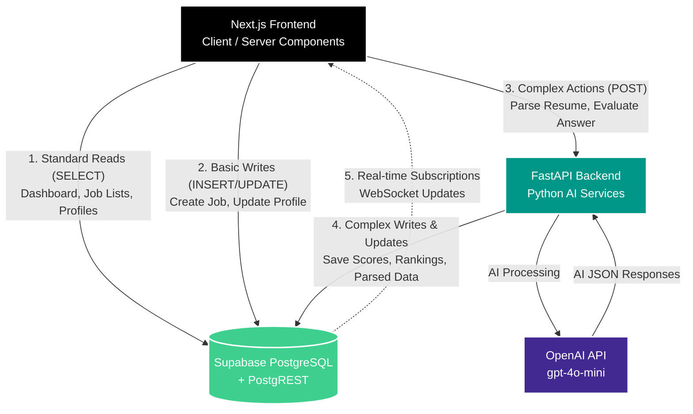

# CRUD Data-Flow Architecture

To optimize for **low latency**, **scalability**, and **clean architecture**, we will adopt the **Command Query Responsibility Segregation (CQRS) inspired pattern**. 

Standard data fetching (Queries) and basic mutations will go directly from Next.js to Supabase, leveraging PostgREST for extreme speed. Complex mutations (Commands) involving AI, file parsing, or heavy business logic will route through FastAPI.

## 1. Data-Flow Diagram

---

## 2. Next.js → Supabase (Direct)

**Why:** Supabase's auto-generated REST API (PostgREST) is significantly faster than proxying requests through a Python backend. It eliminates a network hop, reduces backend server load, and is fully secured by Row Level Security (RLS). Next.js React Server Components (RSC) will execute these fetches securely on the edge/server.

### Operations Assigned:
- **Read Jobs**: Fetching job listings for the candidate portal or the recruiter dashboard.
- **Read Candidates**: Fetching the ranked list of candidates for a specific job.
- **Read Evaluations**: Viewing a candidate's detailed score breakdown, interview responses, and reasoning logs.
- **Create/Update Jobs**: A recruiter saving a new job posting or toggling a job's status to 'Closed' (Standard CRUD without AI).
- **Fetch Interview Questions**: A candidate loading the questions to begin their asynchronous interview.
- **Real-time Updates**: Next.js listening to Supabase real-time channels for instant UI updates when FastAPI finishes evaluating a candidate.

---

## 3. Next.js → FastAPI → Supabase

**Why:** FastAPI is our dedicated microservice for CPU-intensive tasks, external AI integrations, and complex transactional business logic. Moving these to the Python backend keeps the Next.js frontend thin and focuses Python on what it does best (AI, Data Processing).

### Operations Assigned:

- **Process Candidate Application (Resume Parsing)**
  - *Flow*: Candidate uploads CV → Next.js sends file to FastAPI → FastAPI parses PDF via `pypdf` → FastAPI sends text to OpenAI to generate summary and match score → FastAPI saves Candidate, Application, and Skills to Supabase.
  - *Reason*: Heavy text processing and AI orchestration should not run on Vercel Edge functions due to timeout limits and lack of native Python AI libraries.

- **Generate Interview Questions**
  - *Flow*: Recruiter clicks "Generate Questions" → FastAPI fetches Job description and Candidate resume from Supabase → FastAPI queries OpenAI for tailored questions → FastAPI bulk-inserts questions into Supabase.
  - *Reason*: Requires complex prompt engineering and structured JSON parsing.

- **Submit Interview Answer (Evaluation)**
  - *Flow*: Candidate submits a text/audio answer → FastAPI sends the answer and the ideal answer to OpenAI → OpenAI grades the response → FastAPI calculates the new "Overall Score" and "Truthfulness Score" → FastAPI saves the evaluation and re-ranks all candidates in Supabase.
  - *Reason*: Requires AI evaluation, calculation of composite scores, and transactional updates across multiple tables (updating the individual answer, updating the overall application score, and adjusting the global ranking).

- **Proctoring Analysis**
  - *Flow*: Next.js detects tab-switches and sends telemetry to FastAPI → FastAPI triggers the truthfulness AI evaluation → FastAPI writes to `reasoning_logs`.
  - *Reason*: Security/integrity logic should be abstracted away from the client and processed securely on the backend.
