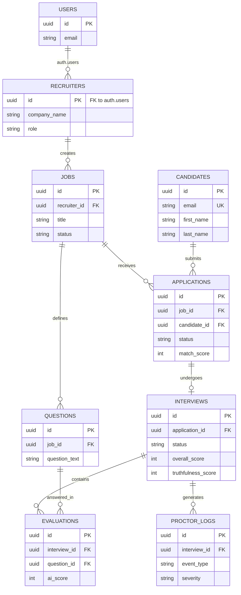

# AI-Recruit360 Database Schema Design

This document details a production-grade PostgreSQL schema tailored for the AI-Recruit360 platform, utilizing Supabase for Authentication and Row Level Security (RLS).

## 1. Entity-Relationship Diagram (ERD)

---

## 2. Tables & Explanations

1. **`recruiters` (Authentication)**
   - **Purpose**: Extends the native Supabase `auth.users` table with application-specific profile data for users managing the recruitment process.
   - **Columns**: `id` (UUID), `company_name` (VARCHAR), `role` (ENUM: admin, recruiter), `created_at` (TIMESTAMPTZ).

2. **`jobs` (Jobs)**
   - **Purpose**: Stores the job postings created by recruiters.
   - **Columns**: `id` (UUID), `recruiter_id` (UUID), `title` (VARCHAR), `department` (VARCHAR), `description` (TEXT), `status` (ENUM: draft, active, closed), `created_at`, `updated_at`.

3. **`candidates` (Candidates)**
   - **Purpose**: Stores individual candidates. Normalizing this from applications ensures that a candidate who applies to multiple jobs only has one profile.
   - **Columns**: `id` (UUID), `email` (VARCHAR, UNIQUE), `first_name` (VARCHAR), `last_name` (VARCHAR), `phone` (VARCHAR), `created_at`, `updated_at`.

4. **`applications` (Applications)**
   - **Purpose**: The junction between a Candidate and a Job. Stores resume details and AI parsing outputs.
   - **Columns**: `id` (UUID), `job_id` (UUID), `candidate_id` (UUID), `status` (ENUM: pending, screening, interviewed, offered, rejected), `cv_url` (VARCHAR), `ai_summary` (TEXT), `match_score` (SMALLINT), `hiring_confidence` (SMALLINT), `applied_at`.

5. **`questions` (Questions)**
   - **Purpose**: Holds the dynamic AI-generated or manually added questions specifically tailored for a Job or Application.
   - **Columns**: `id` (UUID), `job_id` (UUID), `question_text` (TEXT), `ideal_answer` (TEXT), `created_at`.

6. **`interviews` (Interviews)**
   - **Purpose**: Tracks a candidate's asynchronous interview session linked to an application.
   - **Columns**: `id` (UUID), `application_id` (UUID, UNIQUE), `status` (ENUM: scheduled, in_progress, completed, abandoned), `started_at`, `completed_at`, `overall_score` (SMALLINT), `truthfulness_score` (SMALLINT).

7. **`evaluations` (Evaluations)**
   - **Purpose**: Stores the candidate's answer to a specific question and the AI's subsequent scoring.
   - **Columns**: `id` (UUID), `interview_id` (UUID), `question_id` (UUID), `candidate_answer` (TEXT), `ai_score` (SMALLINT), `evaluation_status` (ENUM: Excellent, Strong, Weak, Irrelevant), `ai_feedback` (TEXT).

8. **`proctor_logs` (Proctor Logs)**
   - **Purpose**: An append-only audit log capturing behavioral signals (e.g., tab switching) during the interview to determine truthfulness.
   - **Columns**: `id` (UUID), `interview_id` (UUID), `event_type` (VARCHAR), `description` (TEXT), `severity` (ENUM: info, warning, critical), `created_at`.

---

## 3. Relationships & 4. Foreign Keys

| From Table | Column | To Table | Column | Relationship | On Delete |
| :--- | :--- | :--- | :--- | :--- | :--- |
| `recruiters` | `id` | `auth.users` | `id` | 1:1 | `CASCADE` |
| `jobs` | `recruiter_id` | `recruiters` | `id` | 1:N | `SET NULL` |
| `applications` | `job_id` | `jobs` | `id` | 1:N | `CASCADE` |
| `applications` | `candidate_id` | `candidates` | `id` | 1:N | `CASCADE` |
| `questions` | `job_id` | `jobs` | `id` | 1:N | `CASCADE` |
| `interviews` | `application_id` | `applications` | `id` | 1:1 | `CASCADE` |
| `evaluations` | `interview_id` | `interviews` | `id` | 1:N | `CASCADE` |
| `evaluations` | `question_id` | `questions` | `id` | 1:N | `CASCADE` |
| `proctor_logs` | `interview_id` | `interviews` | `id` | 1:N | `CASCADE` |

---

## 5. Indexes

To ensure production-grade read performance, the following B-Tree indexes are required:
- `idx_jobs_recruiter_id` on `jobs(recruiter_id)`
- `idx_candidates_email` on `candidates(email)` (Unique index)
- `idx_applications_job_id` on `applications(job_id)`
- `idx_applications_candidate_id` on `applications(candidate_id)`
- `idx_interviews_application_id` on `interviews(application_id)`
- `idx_evaluations_interview_id` on `evaluations(interview_id)`
- `idx_proctor_logs_interview_id` on `proctor_logs(interview_id)`

**Composite Index**:
- `idx_evaluations_interview_question` on `evaluations(interview_id, question_id)` for faster joins and preventing duplicate answers.

---

## 6. Constraints

- **Primary Keys**: UUIDs with `gen_random_uuid()` as default on all tables.
- **Unique Constraints**:
  - `candidates(email)`: Prevent duplicate candidate accounts.
  - `applications(job_id, candidate_id)`: A candidate can only apply to the same job once.
  - `interviews(application_id)`: Enforces the 1:1 relationship between an application and an interview session.
- **Check Constraints**:
  - `match_score`, `hiring_confidence`, `overall_score`, `truthfulness_score`, `ai_score`: Must be `>= 0 AND <= 100`.
  - Application Status Enum check: `IN ('pending', 'screening', 'interviewed', 'offered', 'rejected')`
  - Severity Enum check: `IN ('info', 'warning', 'critical')`

---

## 7. Supabase Row Level Security (RLS) Policies

To enforce strict multi-tenant security, policies will be defined based on the authenticated user's `auth.uid()`.

1. **`recruiters`**:
   - `SELECT`, `UPDATE`: Users can only read and update their own row `(id = auth.uid())`.

2. **`jobs`**:
   - `SELECT`: Publicly readable if `status = 'active'`. Recruiters can read all their own jobs `(recruiter_id = auth.uid())`.
   - `INSERT`, `UPDATE`, `DELETE`: Only allowed if `recruiter_id = auth.uid()`.

3. **`candidates`**:
   - `SELECT`: Recruiters can read candidates that have applied to their jobs. (Requires a joined policy via `applications`).
   - `INSERT`: Allowed publicly (so candidates can submit forms), but `UPDATE`/`DELETE` restricted to the service role or linked recruiter.

4. **`applications`**:
   - `SELECT`: Recruiters can read applications where `job_id` maps to their `jobs` table `(EXISTS (SELECT 1 FROM jobs WHERE jobs.id = applications.job_id AND jobs.recruiter_id = auth.uid()))`.
   - `INSERT`: Allowed publicly (via anonymous API key) for submitting job applications.

5. **`questions`**:
   - `SELECT`: Publicly readable (required to fetch questions during an interview).
   - `INSERT/UPDATE/DELETE`: Restricted to the recruiter owning the associated job.

6. **`interviews`, `evaluations`, `proctor_logs`**:
   - `INSERT`: Allowed publicly via an anonymous API key, ideally secured via an interview token or limited to row-creation only (no updates).
   - `SELECT`: Restricted to the recruiter owning the job associated with the `application_id`.
   - `UPDATE`/`DELETE`: Strictly forbidden for candidates. Restricted to `service_role` (for AI processing updates) or the recruiter.
