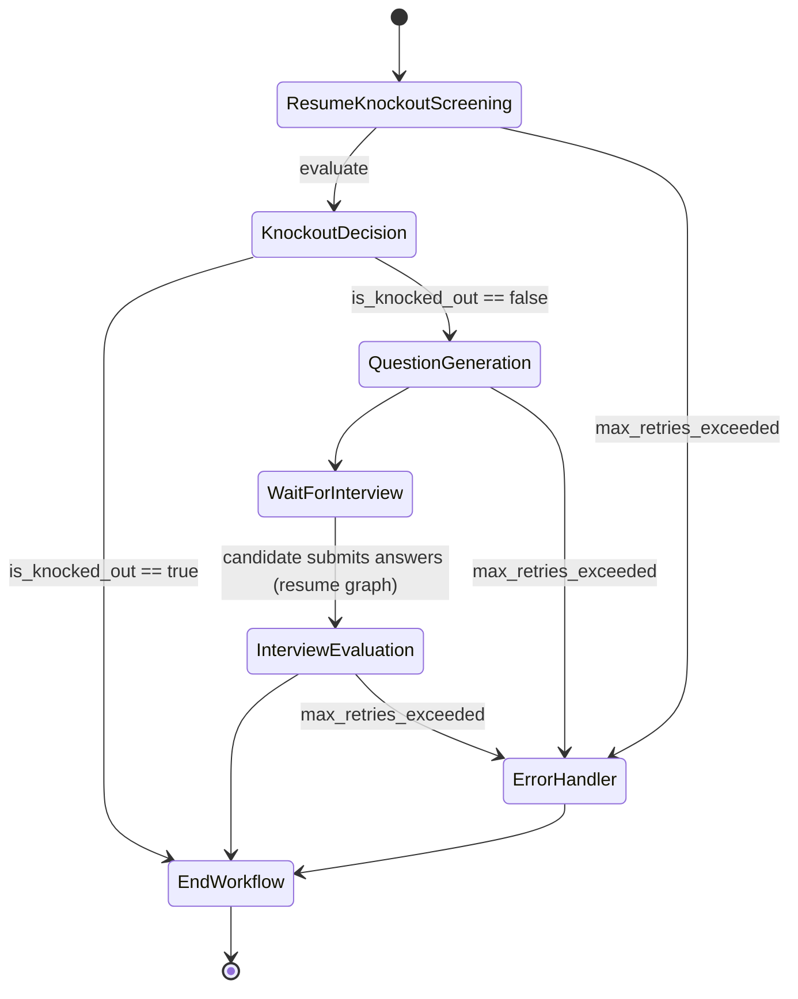

# LangGraph Workflow Design

This document details the production-ready LangGraph architecture for the AI-Recruit360 multi-agent pipeline. The graph spans across multiple asynchronous events, utilizing LangGraph Checkpointers to persist state while waiting for the candidate to complete their interview.

## 1. Graph Diagram



## 2. State Definition

We use a strongly typed Pydantic-based `TypedDict` for the `GraphState` to ensure schema validation across all agents.

```python
from typing import TypedDict, List, Dict, Optional
from pydantic import BaseModel

class InterviewQAPair(BaseModel):
    question: str
    answer: str

class GraphState(TypedDict):
    # Inputs
    candidate_id: str
    job_id: str
    job_description: str
    resume_text: str
    
    # Agent 1 Outputs
    knockout_score: Optional[int]
    is_knocked_out: Optional[bool]
    knockout_reason: Optional[str]
    
    # Agent 2 Outputs
    generated_questions: Optional[List[str]]
    
    # Human-in-the-loop Input
    candidate_answers: Optional[List[InterviewQAPair]]
    
    # Agent 3 Outputs
    evaluation_scores: Optional[List[int]]
    overall_score: Optional[int]
    truthfulness_score: Optional[int]
    final_decision: Optional[str] # "Verified Match", "Review Needed", "Risk Detected"
    
    # Resilience
    errors: List[str]
    retry_count: int
```

## 3. Node Definitions

### `resume_knockout_node` (Agent 1)
- **Role**: Validates if the candidate meets the absolute minimum requirements (e.g., years of experience, mandatory skills).
- **Logic**: Injects `job_description` and `resume_text` into an OpenAI Structured Output prompt. 
- **State Update**: Updates `knockout_score`, `is_knocked_out`, and resets `retry_count` on success.

### `question_generation_node` (Agent 2)
- **Role**: Acts only on valid candidates. Generates technical questions specifically challenging the candidate's claims.
- **Logic**: Uses `resume_text` to find unique claims and crafts 5-10 specific questions.
- **State Update**: Appends to `generated_questions`.

### `wait_for_interview` (Human-in-the-loop)
- **Role**: This is an interrupt node. The graph yields execution here and saves the state to PostgreSQL (via LangGraph's `AsyncPostgresSaver`). The backend returns control to the frontend. Once the candidate submits their answers, the backend resumes the graph with the `candidate_answers` payload.

### `interview_evaluation_node` (Agent 3)
- **Role**: Evaluates the submitted answers against the job requirements and ideal answers.
- **Logic**: Performs semantic evaluation of answers and analyzes behavioral signals for the `truthfulness_score`.
- **State Update**: Populates `evaluation_scores`, `overall_score`, and calculates the `final_decision`.

### `error_handler_node`
- **Role**: Centralized fallback. If any node fails fatally, this node logs the error to Sentry/Supabase, updates the candidate status to "System Error - Manual Review Required", and safely terminates the graph.

## 4. Edge Routing

Routing functions determine the next step based on the current state.

```python
def route_after_knockout(state: GraphState) -> str:
    if len(state.get("errors", [])) > 0 and state["retry_count"] >= 3:
        return "error_handler_node"
    if state.get("is_knocked_out"):
        return "end_workflow"
    return "question_generation_node"

def route_retry(state: GraphState, current_node: str) -> str:
    """Generic retry router for any AI node"""
    if state["retry_count"] >= 3:
        return "error_handler_node"
    return current_node
```

## 5. Retry Logic

Production AI systems must tolerate OpenAI timeouts and structured output parsing failures.
- **Implementation**: Inside each Agent node, a `try/except` block wraps the LLM call.
- **Failure**: If an exception occurs, the node catches it, appends the error string to `state["errors"]`, increments `state["retry_count"]`, and returns. 
- **Routing**: The edge function checks `retry_count`. If `< 3`, it routes back to the *same node*. If `>= 3`, it routes to `error_handler_node`.

## 6. Error Handling

Instead of allowing the FastAPI request to crash or the graph to throw an unhandled exception:
1. **State Preservation**: The graph's current state is safely persisted in the Checkpointer DB before routing to the error handler.
2. **Graceful Degradation**: The `error_handler_node` updates the Supabase `candidates` table with `status = 'Error'` so recruiters are aware the AI pipeline stalled.
3. **Recovery**: Because state is persisted, an administrator can manually fix the issue (e.g., bad API key) and manually resume the graph execution from the exact point of failure using the thread ID.
