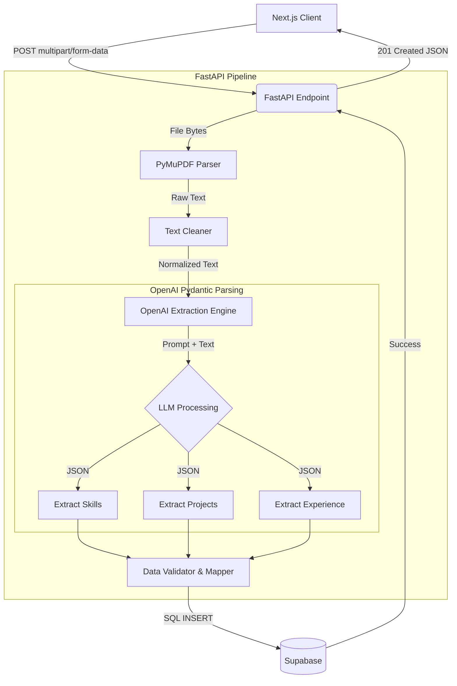

# Resume Processing Pipeline Design

This document outlines the architecture, data flow, and database schema for the end-to-end resume processing pipeline, transforming raw PDF uploads into structured candidate profiles using PyMuPDF and OpenAI Structured Outputs.

## 1. Architecture

The processing pipeline will be isolated entirely within the **FastAPI backend** to leverage Python's robust data parsing libraries and OpenAI SDK.

- **Parser Engine**: **PyMuPDF** (`fitz`). It handles complex layouts, columns, and embedded fonts much better than `pypdf`.
- **Text Normalization**: Regex-based cleaning utility to strip non-ASCII characters, excessive whitespaces, and unreadable ligatures.
- **Extraction Engine**: **OpenAI (`gpt-4o-mini`)** utilizing **Structured Outputs**. We will define strict Pydantic models for Skills, Projects, and Experience to guarantee the LLM returns perfectly typed JSON.
- **Storage Layer**: Supabase PostgreSQL.

## 2. Data Flow



## 3. Database Schema Updates

To support the highly structured output of the pipeline, we need to expand the existing schema with dedicated tables for Experience and Projects, and enrich the Skills table.

### Expanded Schema Details

**`candidates`**
- `id` (UUID, PK)
- `email`, `first_name`, `last_name`, `phone`

**`applications`**
- `id` (UUID, PK)
- `job_id` (UUID, FK)
- `candidate_id` (UUID, FK)
- `cv_url` (VARCHAR)
- `ai_summary` (TEXT)

**`skills`**
- `id` (UUID, PK)
- `candidate_id` (UUID, FK)
- `skill_name` (VARCHAR)
- `category` (ENUM: 'language', 'framework', 'tool', 'soft_skill')
- `is_verified` (BOOLEAN)

**`projects`** *(NEW)*
- `id` (UUID, PK)
- `candidate_id` (UUID, FK)
- `title` (VARCHAR)
- `description` (TEXT)
- `technologies_used` (TEXT[])
- `project_url` (VARCHAR, nullable)

**`experience`** *(NEW)*
- `id` (UUID, PK)
- `candidate_id` (UUID, FK)
- `company_name` (VARCHAR)
- `role_title` (VARCHAR)
- `start_date` (DATE)
- `end_date` (DATE, nullable)
- `is_current` (BOOLEAN)
- `responsibilities` (TEXT[])

## 4. Error Handling Strategy

Robust error handling is critical for asynchronous AI file processing.

| Failure Point | Detection Method | Fallback / Resolution | Client Response |
| :--- | :--- | :--- | :--- |
| **Corrupted / Encrypted PDF** | PyMuPDF `fitz.FileDataError` | Reject file immediately. | `400 Bad Request: "Invalid or encrypted PDF"` |
| **Image-Only PDF (No Text)** | PyMuPDF extracts `< 50 chars` | Option to trigger OCR (Tesseract), otherwise reject. | `422 Unprocessable Entity: "No selectable text found. Please upload a standard text PDF."` |
| **OpenAI Rate Limit / Timeout** | `openai.RateLimitError` | Use `tenacity` for exponential backoff (e.g., 3 retries). | `503 Service Unavailable: "AI service currently busy, please try again."` |
| **OpenAI Schema Mismatch** | Pydantic `ValidationError` | Retry prompt once with strict instruction flag, else fail. | `500 Internal Server Error: "Failed to parse resume structure."` |
| **Supabase DB Failure** | `postgrest.exceptions.APIError` | Rollback transaction. Log error to Sentry/Logger. | `500 Internal Server Error: "Database insertion failed."` |

## 5. API Endpoints

### `POST /api/v1/applications/parse-resume`

**Request:**
- Content-Type: `multipart/form-data`
- Body: 
  - `file`: `UploadFile` (The PDF resume)
  - `job_id`: `UUID` (The job they are applying for)

**Response:**
```json
// 201 Created
{
  "application_id": "uuid-1234",
  "candidate": {
    "first_name": "Sarah",
    "last_name": "Williams",
    "email": "sarah.williams@email.com"
  },
  "summary": "Senior React Developer with 6 years experience...",
  "skills": [
    {"name": "React", "category": "framework"},
    {"name": "TypeScript", "category": "language"}
  ],
  "experience": [
    {
      "company_name": "Tech Corp",
      "role_title": "Frontend Lead",
      "start_date": "2020-01-01",
      "is_current": true,
      "responsibilities": ["Led migration to Next.js", "Managed team of 4"]
    }
  ],
  "projects": [
    {
      "title": "E-Commerce Platform",
      "technologies_used": ["React", "Stripe"],
      "description": "Built a scalable e-commerce frontend."
    }
  ]
}
```
