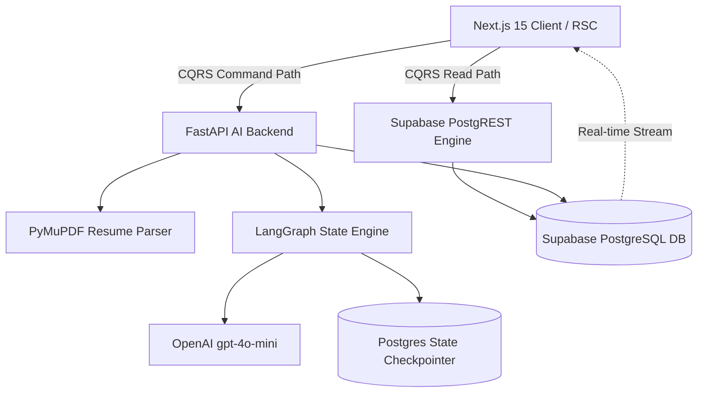

# AI-Recruit360: Master Architecture Specification (FYP Thesis Edition)

> [!NOTE]
> This folder (`/Architecture`) contains the original modular design specifications created during the initial phase of the project.
> 
> The **definitive, unified, master enterprise architecture document** for the **BS Software Engineering Final Year Project (FYP) Thesis** and evaluation by external startups/examiners has been compiled and generated at:
> 
> 👉 **[`/ARCHITECTURE.md`](file:///d:/Final%20Year%20Project/ai-recruit360/ARCHITECTURE.md)**

---

## Architecture Index & Mapping

| Initial Module Design | Description | Status in Final Architecture |
| :--- | :--- | :--- |
| [`ai_evaluation_engine_design.md`](file:///d:/Final%20Year%20Project/ai-recruit360/Architecture/ai_evaluation_engine_design.md) | CoT Prompting, 4D Scoring (Tech 40%, Prob 25%, Comm 15%, Honesty 20%), XAI Triad | Integrated in Section 4 |
| [`auth_architecture_plan.md`](file:///d:/Final%20Year%20Project/ai-recruit360/Architecture/auth_architecture_plan.md) | Supabase Auth, RBAC, JWKS, Next.js Middleware, FastAPI Security | Integrated in Section 7 |
| [`data_flow_architecture.md`](file:///d:/Final%20Year%20Project/ai-recruit360/Architecture/data_flow_architecture.md) | CQRS Pattern (Direct PostgREST Reads vs. FastAPI AI Commands) | Integrated in Section 2 |
| [`database_schema_design.md`](file:///d:/Final%20Year%20Project/ai-recruit360/Architecture/database_schema_design.md) | PostgreSQL ERD, 11 Normalized Tables, Indexes, Constraints, RLS | Integrated in Section 3 |
| [`implementation_plan.md`](file:///d:/Final%20Year%20Project/ai-recruit360/Architecture/implementation_plan.md) | Next.js `src/` layout, FastAPI Clean Architecture & Repository Pattern | Integrated in Section 9 |
| [`langgraph_workflow_design.md`](file:///d:/Final%20Year%20Project/ai-recruit360/Architecture/langgraph_workflow_design.md) | LangGraph Multi-Agent Engine, `AsyncPostgresSaver`, Interrupt Nodes | Integrated in Section 5 |
| [`production_readiness_review.md`](file:///d:/Final%20Year%20Project/ai-recruit360/Architecture/production_readiness_review.md) | Enterprise security, scalability, testing, and observability checklists | Integrated in Sections 7 & 10 |
| [`project_audit_report.md`](file:///d:/Final%20Year%20Project/ai-recruit360/Architecture/project_audit_report.md) | Initial codebase audit identifying vulnerabilities & refactoring goals | Synthesized in Executive Summary |
| [`recruiter_dashboard_design.md`](file:///d:/Final%20Year%20Project/ai-recruit360/Architecture/recruiter_dashboard_design.md) | Data-Dense Layout, RSC strategy, Recharts analytics (Radar, Bar, Area) | Integrated in Section 8 |
| [`resume_processing_pipeline.md`](file:///d:/Final%20Year%20Project/ai-recruit360/Architecture/resume_processing_pipeline.md) | PyMuPDF text ingestion, OpenAI Pydantic Structured Outputs | Integrated in Section 6 |

---

## Core System Architecture Overview

---

> Refer to [**`ARCHITECTURE.md`**](file:///d:/Final%20Year%20Project/ai-recruit360/ARCHITECTURE.md) for the complete thesis documentation including all Mermaid diagrams, mathematical models, Pydantic schemas, SQL migrations, and the **FYP Examination Defense Guide**.
