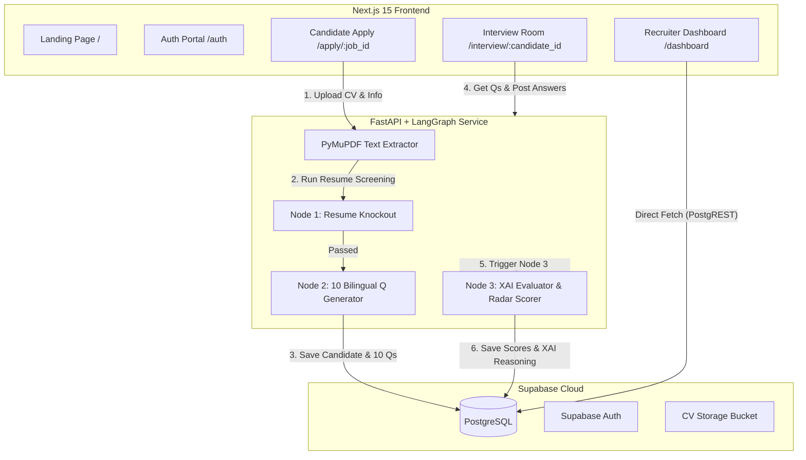

# Ultimate Master Blueprint: AI-Recruit360 (Professional FYP Edition)

This document is the **definitive, end-to-end master execution blueprint** for building **AI-Recruit360**. It combines enterprise AI architecture with an FYP-optimized execution strategy: zero unnecessary complexity, airtight database setup, bilingual question generation, XAI scoring, and high-impact visual dashboards.

---

## User Review Required

> [!IMPORTANT]
> This blueprint merges your Gemini Pro workflow with our enterprise architectural review into a single, clean 6-step roadmap. Follow this sequence precisely to ensure 100% build stability, zero missing dependencies, and maximum visual impact for university presentation.

---

## 1. System Architecture & Tech Stack

- **Database & Auth**: Supabase PostgreSQL + Supabase Auth + Supabase Storage (`resumes` bucket).
- **Backend Core**: FastAPI (Python 3.11+), Pydantic v2, PyMuPDF (`fitz`), LangGraph (`StateGraph`), OpenAI SDK (`gpt-4o-mini`).
- **Frontend App**: Next.js 15 (App Router), TypeScript, Tailwind CSS v4, Shadcn UI, Recharts, Lucide Icons.
- **Design Palette (B2B SaaS Theme)**:
  - Primary Background: Dark Navy (`#0F172A`)
  - Brand Accent: Cyan (`#0EA5E9`)
  - Secondary Text/Borders: Slate (`#64748B`)
  - Dashboard Light Mode: Off-white (`#F8FAFC`)



---

## 2. Master Step-by-Step Execution Sequence

### **Step 1: Database Setup (Manual Execution in Supabase SQL Editor)**

1. Log into [Supabase Console](https://supabase.com).
2. Create a new project named `ai-recruit360`.
3. Under **Project Settings > API**, copy your `Project URL` and `service_role` / `anon` keys.
4. Go to **SQL Editor**, paste the script below, and click **Run**:

```sql
-- 1. Create Recruiters Profile Table (Extends auth.users)
CREATE TABLE IF NOT EXISTS public.recruiters (
    id UUID PRIMARY KEY REFERENCES auth.users(id) ON DELETE CASCADE,
    full_name TEXT NOT NULL,
    company_name TEXT NOT NULL,
    company_website TEXT,
    role TEXT DEFAULT 'recruiter',
    created_at TIMESTAMPTZ DEFAULT timezone('utc', now()) NOT NULL
);

-- 2. Create Jobs Table (Linked to Recruiter)
CREATE TABLE IF NOT EXISTS public.jobs (
    id UUID DEFAULT gen_random_uuid() PRIMARY KEY,
    recruiter_id UUID REFERENCES public.recruiters(id) ON DELETE CASCADE NOT NULL,
    title TEXT NOT NULL,
    description TEXT NOT NULL,
    department TEXT,
    min_experience INT DEFAULT 0,
    status TEXT DEFAULT 'active' CHECK (status IN ('active', 'closed', 'draft')),
    created_at TIMESTAMPTZ DEFAULT timezone('utc', now()) NOT NULL
);

-- 3. Create Candidates Table (Linked to Specific Job)
CREATE TABLE IF NOT EXISTS public.candidates (
    id UUID DEFAULT gen_random_uuid() PRIMARY KEY,
    job_id UUID REFERENCES public.jobs(id) ON DELETE CASCADE NOT NULL,
    name TEXT NOT NULL,
    email TEXT NOT NULL,
    github_url TEXT,
    cv_url TEXT,
    resume_text TEXT,
    status TEXT DEFAULT 'pending' CHECK (status IN ('pending', 'interviewing', 'completed', 'rejected')),
    ai_score INT DEFAULT 0,
    technical_score INT DEFAULT 0,
    communication_score INT DEFAULT 0,
    honesty_score INT DEFAULT 0,
    xai_reasoning JSONB DEFAULT '{}'::jsonb,
    generated_questions JSONB DEFAULT '[]'::jsonb,
    current_question_index INT DEFAULT 0,
    interview_transcript TEXT DEFAULT '',
    created_at TIMESTAMPTZ DEFAULT timezone('utc', now()) NOT NULL
);

-- 4. Create Proctor Logs Table (Linked to Candidate)
CREATE TABLE IF NOT EXISTS public.proctor_logs (
    id UUID DEFAULT gen_random_uuid() PRIMARY KEY,
    candidate_id UUID REFERENCES public.candidates(id) ON DELETE CASCADE NOT NULL,
    event_type TEXT NOT NULL,
    created_at TIMESTAMPTZ DEFAULT timezone('utc', now()) NOT NULL
);

-- 5. Automatic Trigger: Create Recruiter Profile on Auth User Signup
CREATE OR REPLACE FUNCTION public.handle_new_recruiter()
RETURNS TRIGGER AS $$
BEGIN
    INSERT INTO public.recruiters (id, full_name, company_name)
    VALUES (
        NEW.id,
        COALESCE(NEW.raw_user_meta_data->>'full_name', 'Recruiter'),
        COALESCE(NEW.raw_user_meta_data->>'company_name', 'My Company')
    )
    ON CONFLICT (id) DO NOTHING;
    RETURN NEW;
END;
$$ LANGUAGE plpgsql SECURITY DEFINER;

DROP TRIGGER IF EXISTS on_auth_user_created ON auth.users;
CREATE TRIGGER on_auth_user_created
    AFTER INSERT ON auth.users
    FOR EACH ROW EXECUTE FUNCTION public.handle_new_recruiter();

-- 6. Enable Row Level Security (RLS)
ALTER TABLE public.recruiters ENABLE ROW LEVEL SECURITY;
ALTER TABLE public.jobs ENABLE ROW LEVEL SECURITY;
ALTER TABLE public.candidates ENABLE ROW LEVEL SECURITY;
ALTER TABLE public.proctor_logs ENABLE ROW LEVEL SECURITY;

-- 7. Define Row Level Security (RLS) Policies
CREATE POLICY "Recruiters read/update own profile" ON public.recruiters FOR ALL USING (auth.uid() = id);

CREATE POLICY "Recruiters manage own jobs" ON public.jobs FOR ALL USING (auth.uid() = recruiter_id);
CREATE POLICY "Public read active jobs" ON public.jobs FOR SELECT USING (status = 'active');

CREATE POLICY "Public insert candidates" ON public.candidates FOR INSERT WITH CHECK (true);
CREATE POLICY "Public read candidate interview" ON public.candidates FOR SELECT USING (true);
CREATE POLICY "Recruiters view own job candidates" ON public.candidates FOR ALL USING (
    EXISTS (
        SELECT 1 FROM public.jobs 
        WHERE jobs.id = candidates.job_id 
        AND jobs.recruiter_id = auth.uid()
    )
);

CREATE POLICY "Public insert proctor logs" ON public.proctor_logs FOR INSERT WITH CHECK (true);
CREATE POLICY "Recruiters view proctor logs for own candidates" ON public.proctor_logs FOR SELECT USING (
    EXISTS (
        SELECT 1 FROM public.candidates
        JOIN public.jobs ON jobs.id = candidates.job_id
        WHERE candidates.id = proctor_logs.candidate_id
        AND jobs.recruiter_id = auth.uid()
    )
);

-- 8. Storage Bucket for Resumes
INSERT INTO storage.buckets (id, name, public) VALUES ('resumes', 'resumes', true) ON CONFLICT (id) DO NOTHING;
```

---

### **Step 2: Backend Core Setup (FastAPI & Dependencies)**

Create the `backend/` skeleton, install dependencies, and configure environment variables.

#### Folder Structure:
```text
backend/
├── src/
│   ├── api/
│   │   ├── dependencies.py
│   │   └── routers/
│   │       ├── jobs.py
│   │       ├── apply.py
│   │       └── interview.py
│   ├── core/
│   │   ├── config.py
│   │   └── database.py
│   ├── services/
│   │   ├── pdf_parser.py
│   │   └── ai_agent.py
│   └── main.py
├── .env
└── requirements.txt
```

#### Key Dependencies (`backend/requirements.txt`):
```text
fastapi==0.115.5
uvicorn[standard]==0.32.0
supabase==2.10.0
python-dotenv==1.0.1
pydantic==2.9.2
python-multipart==0.0.12
pymupdf==1.24.14
langchain-openai==0.2.8
langgraph==0.2.45
```

---

### **Step 3: LangGraph AI Engine (`backend/src/services/ai_agent.py`)**

Build the 3-Node LangGraph StateMachine:

1. **`resume_text_extractor` (`pdf_parser.py`)**: Uses PyMuPDF (`fitz`) to convert uploaded resume PDF bytes into clean normalized text string.
2. **Node 1: Knockout Filter (`knockout_node`)**:
   - Input: Candidate `resume_text` + `job_description`.
   - Output: `{ passed: bool, reason: str }`.
3. **Node 2: Question Generator (`question_generator_node`)**:
   - Input: Candidate `resume_text` + `job_description`.
   - Output: 10 customized conversational technical questions probing candidate resume projects, supporting both English and Urdu articulation.
4. **Node 3: XAI Evaluator (`evaluator_node`)**:
   - Input: Complete `interview_transcript` + `resume_text` + `proctor_logs`.
   - Output: Pydantic Structured JSON:
     ```json
     {
       "overall_score": 85,
       "technical_score": 88,
       "communication_score": 90,
       "honesty_score": 75,
       "xai_reasoning": {
         "claim_vs_reality": "...",
         "transcript_evidence": "...",
         "rubric_justification": "..."
       }
     }
     ```

---

### **Step 4: FastAPI Router Integration (`backend/src/api/routers/`)**

Expose 5 key REST endpoints:

- `POST /api/jobs`: Create job posting (Protected by `get_current_recruiter`).
- `GET /api/jobs`: List jobs & candidate counts (Protected).
- `POST /api/apply/{job_id}`: Public candidate submission. Accepts PDF resume $\rightarrow$ PyMuPDF $\rightarrow$ LangGraph Node 1 & 2 $\rightarrow$ Saves to Supabase.
- `GET /api/interview/{candidate_id}/next`: Fetches candidate's current question index and question string.
- `POST /api/interview/{candidate_id}/answer`: Saves candidate text answer $\rightarrow$ Increments index $\rightarrow$ On question 10, triggers `BackgroundTask` to run LangGraph Node 3 Evaluator and update `ai_score` in Supabase.

---

### **Step 5: Frontend Shell & Enterprise Styling (`frontend/`)**

Initialize Next.js 15 App Router with Tailwind CSS & Shadcn UI:

#### Brand Palette Configuration (`tailwind.config.ts`):
```typescript
export default {
  theme: {
    extend: {
      colors: {
        navy: { DEFAULT: '#0F172A', 800: '#1E293B' },
        cyan: { DEFAULT: '#0EA5E9', hover: '#0284C7' },
        slate: { DEFAULT: '#64748B', light: '#94A3B8' },
        light: '#F8FAFC'
      }
    }
  }
}
```

---

### **Step 6: Core Application UI Pages**

1. **Landing Page (`frontend/src/app/page.tsx`)**:
   - Dark Navy Hero Section with Cyan CTA.
   - 4-Step Pipeline diagram (Create Job $\rightarrow$ AI Knockout $\rightarrow$ 10 Q Generation $\rightarrow$ Avatar Room & XAI).
2. **Auth Page (`frontend/src/app/(auth)/auth/page.tsx`)**:
   - Supabase Recruiter Auth login/signup card.
3. **Recruiter Dashboard (`frontend/src/app/(dashboard)/dashboard/page.tsx`)**:
   - Off-white background (`#F8FAFC`), Navy sidebar.
   - Job selection dropdown & candidate leaderboard DataTable sorted by `ai_score DESC`.
   - Clicking a candidate row opens a Shadcn `Sheet` featuring:
     - **Recharts Radar Chart**: Technical, Communication, Honesty scores.
     - **XAI Accordion**: Claim vs. Reality and Transcript evidence quotes.
4. **Candidate Apply Page (`frontend/src/app/apply/[job_id]/page.tsx`)**:
   - Clean white card with Name, Email, GitHub URL, and PDF Drag-and-Drop file zone.
5. **Candidate Interview Room (`frontend/src/app/interview/[candidate_id]/page.tsx`)**:
   - Dark Navy Theme (`bg-[#0F172A]`).
   - 16:9 Video Player placeholder with subtle Cyan pulsating glow.
   - Tab-switch proctoring telemetry listener:
     ```typescript
     useEffect(() => {
       const handleVisibilityChange = () => {
         if (document.hidden) {
           fetch(`/api/interview/${candidateId}/proctor-log`, {
             method: 'POST',
             body: JSON.stringify({ event_type: 'TAB_SWITCH' })
           });
         }
       };
       document.addEventListener('visibilitychange', handleVisibilityChange);
       return () => document.removeEventListener('visibilitychange', handleVisibilityChange);
     }, [candidateId]);
     ```

---

## 3. Verification & Live Demo Plan

### Automated Verification
- Run FastAPI tests to ensure PDF parsing & scoring math run cleanly:
  ```bash
  cd backend
  pytest tests/
  ```
- Run Next.js type check & build verification:
  ```bash
  cd frontend
  npm run build
  ```

### Live Demo Presentation Script
1. **Recruiter Portal**: Log in as Recruiter $\rightarrow$ Create new Job ("Senior Python Developer").
2. **Candidate Apply**: Open Apply page in Incognito mode $\rightarrow$ Fill details & upload sample PDF resume $\rightarrow$ System screens CV & generates 10 tailored questions instantly.
3. **Interview Room**: Open Candidate Interview URL $\rightarrow$ Answer technical questions $\rightarrow$ Switch tabs once to demonstrate real-time proctoring log capture.
4. **Recruiter Leaderboard**: Switch back to Recruiter Dashboard $\rightarrow$ View Candidate leaderboard updated with Overall AI Score, Recharts Radar Chart breakdown, and XAI Reasoning quotes.
5. **Interactive Swagger Docs**: Show professors `http://localhost:8000/docs` to demonstrate live REST endpoints and Pydantic schemas.
